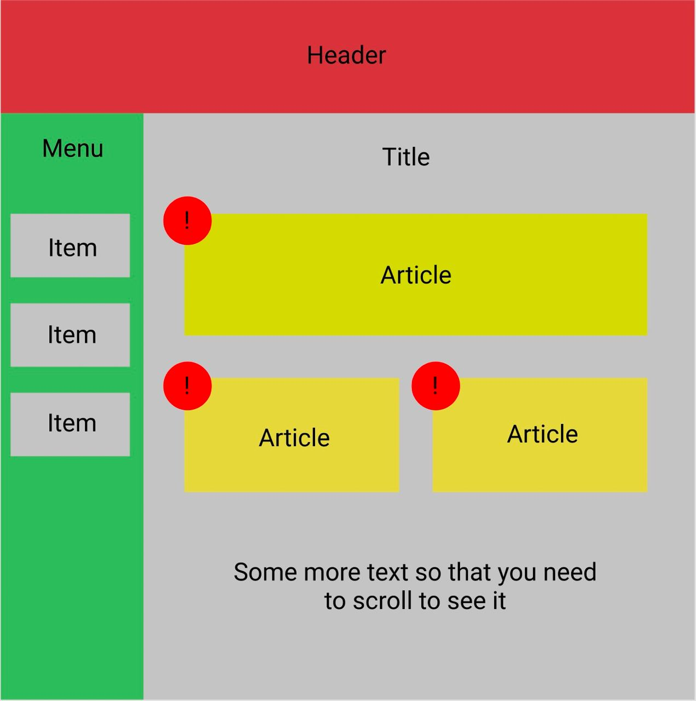

## Домашнее задание 1

Задача состоит в том, чтобы создать файлы html и css, в которых сверстать такой макет.

#### Дедлайны

- Дедлайн без понижающего коэффициента: **17.09.2022**
- Дедлайн с понижающим коэффициентом 0.6: **21.09.2022**
- Дедлайн с понижающим коэффициентом 0.3: **28.09.2022**
- Далее сдать работу можно и получить оценку за нее тоже можно, но в таблицу она не пойдет, 
  так как далее понижающий коэффициент будет считаться равным нулю.
  
#### Особенности формата сдачи ДЗ 1

Первое дз сдается в телеграмме в формате файлов с кодом / архивом с файлами.

